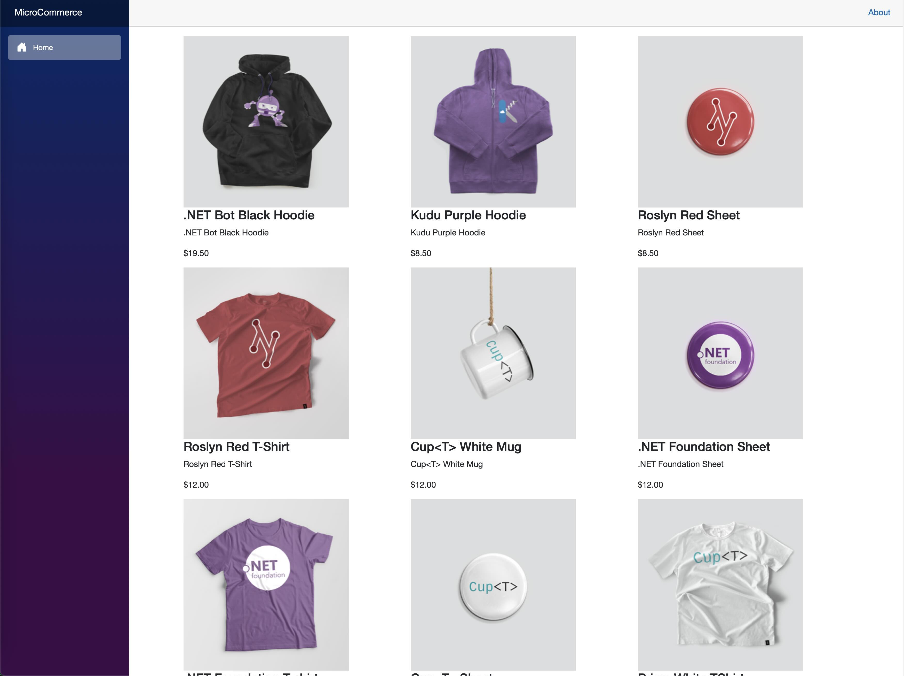

# Micro Commerce

migrating to .net 9 with aspire..............

| Project|Tests|Sonar|
|-|-|-|
|Backend|| |

Inspired by **[`Microsoft eShop`](https://github.com/dotnet/eShop)** my pet project aims to showcase the latest .NET stack. Through this project, we're building a sample e-commerce platform that adheres to microservice principles, enabling scalability, flexibility, and resilience.

## Technical stack

### Infrastructure

- **[`.NET Aspire`](https://learn.microsoft.com/en-us/dotnet/aspire/get-started/aspire-overview)** - .NET Aspire is an opinionated, cloud ready stack for building observable, production ready, distributed applications.
- **[`Kubernetes`](https://kubernetes.io)** - The app is designed to run on Kubernetes (both locally as well as on the cloud)
- **[`ELK`](https://www.elastic.co/elastic-stack)** - The ELK Stack (Elasticsearch, Logstash, Kibana) is a streamlined solution for log management, offering scalable search, data processing, and visualization capabilities in one package.

### Front-end

- **[`Refine`](https://refine.dev)** - Refine is a React meta-framework for CRUD-heavy web applications. It addresses a wide range of enterprise use cases including internal tools, admin panels, dashboards and B2B apps.
- **[`Next.js`](https://nextjs.org)** - A modern server side rendering for React application
  
### Back-end

- **[`.NET Core 9`](https://dotnet.microsoft.com/download)** - .NET Framework and .NET Core, including ASP.NET and ASP.NET Core
- **[`EF Core 9`](https://github.com/dotnet/efcore)** - Modern object-database mapper for .NET. It supports LINQ queries, change tracking, updates, and schema migrations
- **[`MediatR`](https://github.com/jbogard/MediatR)** - Simple, unambitious mediator implementation in .NET

### Testing

- **[`TestContainer`](https://testcontainers.com/guides/getting-started-with-testcontainers-for-dotnet)** - Testcontainers is a testing library that provides easy and lightweight APIs for bootstrapping integration tests with real services wrapped in Docker containers

### CI & CD

- **[`GitHub Actions`](https://github.com/features/actions)**
- **[`Flux CD`](https://fluxcd.io/)** - Flux CD automates Kubernetes deployment from Git, ensuring continuous delivery seamlessly.
- **[`Argo CD`](https://argoproj.github.io/cd/)** - Argo CD is a declarative, GitOps continuous delivery tool for Kubernetes.
- **[`SonarCloud`](https://sonarcloud.io/)**

## Star History

<a href="https://star-history.com/#baotoq/micro-commerce&Date">
 <picture>
   <source media="(prefers-color-scheme: dark)" srcset="https://api.star-history.com/svg?repos=baotoq/micro-commerce&type=Date&theme=dark" />
   <source media="(prefers-color-scheme: light)" srcset="https://api.star-history.com/svg?repos=baotoq/micro-commerce&type=Date" />
   
 </picture>
</a>